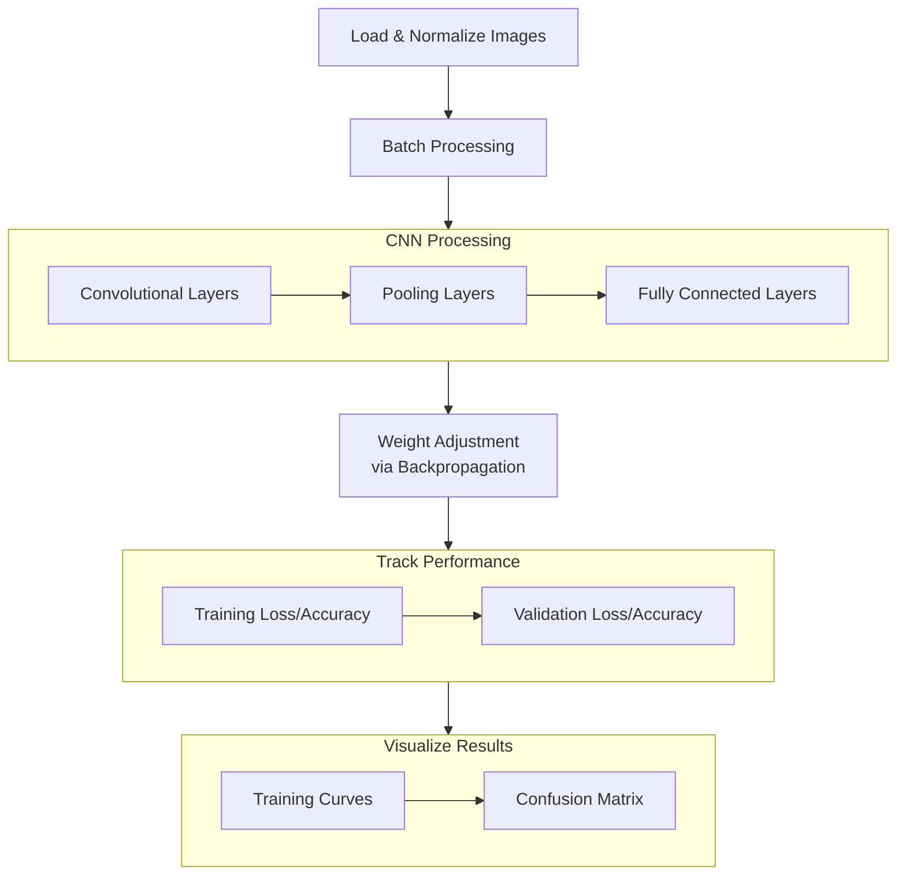

# Current Project Status
  


# Project Explanation


---

## Overview
This is a Convolutional Neural Network project that uses the CIFAR-10 dataset to classify images into 10 categories.

- `data_loader.py` - handles loading and preprocessing the CIFAR-10 images.
- `model.py` - defines the CNN itself with 3 convolutional layers
							1. conv1 - Input (3 Channels) -> 32 filters with a padded 3x3 kernel.
							2. conv2 - 32 channels -> 64 filters with a padded 3x3 kernel.
							3. conv3 - 64 channels -> 64 filters with a padded 3x3 kernel.
- `train.py` - manages the training process across all cycles (epochs)
- `utils.py` - utility functions to creat visualizations of the training progress and performance of the CNN.
- `main.py`  - gets everything, ties it together in a nice bow and runs everything.


---


## Execution Flow

The model runs on GPU if available but will fallback to CPU if one isn't found.


---


## Library Stack
PyTorch - Used for deep learning operations.
matplotlib and seaborn - Used for visualization.
Scikit-learn - Used to calculate how dumb everything is
tqdm - Used for progress bars.

---


## Setup
Windows: run `run.bat`
Linux: run `chmod +x ./run.sh` and then run `./run.sh`

This will setup the necessary project structure, python environment and runs the main.py script to trigger everything.
Onces it's done, the results get created in ./results

---

## Project Structure
```
.
├── data Where all of the model data goes
├── LICENSE
├── main.py
├── requirements.txt
├── results
├── run.bat
├── run.sh
└── src
    ├── data_loader.py
    ├── model.py
    ├── train.py
    └── utils.py
```


# **Current System Specs**
- OS: Zorin  OS 17.2
- CPU: Intel i9-11900KB (16) @ 5.000GHz
- GPUs
		Integrated GPU: Intel TigerLake-H GT1 [UHD Graphics]
		PCI GPU: NVIDIA RTX A4000
- Memory: 64.0 GiB
nvidia-smi output 
``` sql
+-----------------------------------------------------------------------------------------+
| NVIDIA-SMI 550.120                Driver Version: 550.120        CUDA Version: 12.4     |
|-----------------------------------------+------------------------+----------------------+
| GPU  Name                 Persistence-M | Bus-Id          Disp.A | Volatile Uncorr. ECC |
| Fan  Temp   Perf          Pwr:Usage/Cap |           Memory-Usage | GPU-Util  Compute M. |
|                                         |                        |               MIG M. |
|=========================================+========================+======================|
|   0  NVIDIA RTX A4000               Off |   00000000:01:00.0  On |                  Off |
| 41%   49C    P8             17W /  140W |    1946MiB /  16376MiB |     20%      Default |
|                                         |                        |                  N/A |
+-----------------------------------------+------------------------+----------------------+
```
